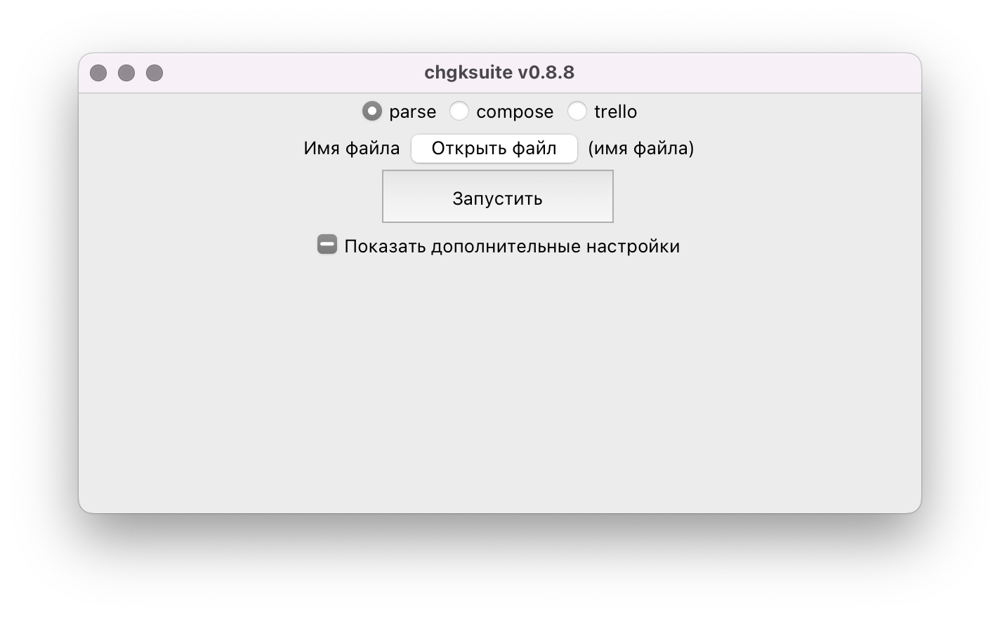
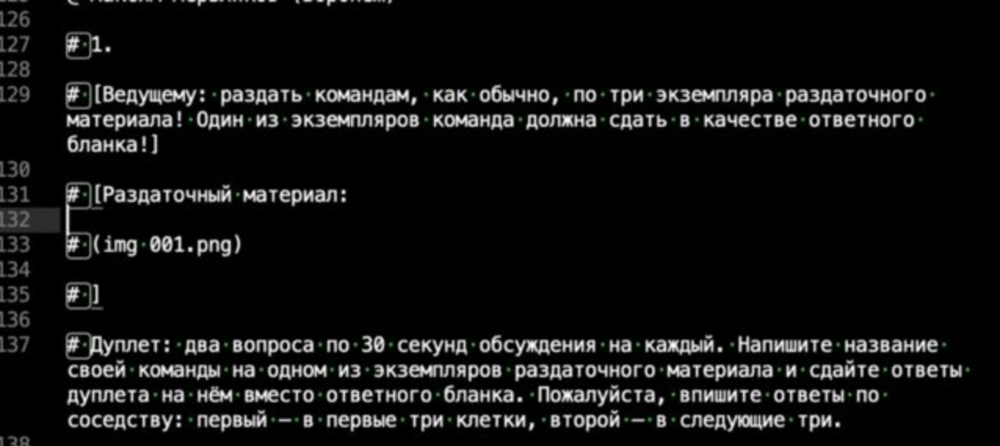

# Формат 4s

**chgksuite** работает с файлами в формате .4s — это микроформат, похожий на [markdown](https://daringfireball.net/projects/markdown/). Вот как выглядит начало [пакета «Интеллектуальной вороны — 2019»](https://db.chgk.info/tour/vorona19_u) в формате 4s:

```
###LJ XIV межрегиональный кубок «Интеллектуальная ворона»

### XIV межрегиональный кубок «Интеллектуальная ворона»

#DATE 2019-05-26

## Тур 1

#EDITOR Редактор — Максим Мерзляко́в (Воронеж).

# _Редактор благодарит за тестирование вопросов и ценные замечания Сергея Донецко́ва, Дмитрия Доро́жко, Александра Кама́ева, Дмитрия Ко́гана, Александра Коробе́йникова, Сергея Кру́пника, Александра Мерзли́кина, Юлию Мещеряко́ву, Дениса Ми́кшиса, Олега Михе́ева, Жанну Подоля́к, Дмитрия Пономарёва, Антона Саксо́нова, Дмитрия Сло́уща, Сергея Тере́нтьева, Наи́ляФару́кшина и Сергея Че́лышева._

? [Раздаточный материал:
Но он не шёл. Луна скрывалась,
Луна сияла сквозь туман,
Бежала мгла... И мне казалось,
Что на снегу сидит Сапсан.
Морозный иней, как алмазы,
Сверкал на нём, а он дремал,
Седой, зобастый, круглоглазый,
И в крылья голову вжимал.
]
Заглавный герой стихотворения Бу́нина, фрагмент которого мы вам раздали, молчалив. Тем не менее, по словам Корне́я Чуко́вского, Бунин вдохновлялся… Каким автором?
! Эдгаром Алланом По.
= по фамилии «По» без неверных уточнений.
/ стихотворение называется «Сапсан». Кроме птичьих названий, с «Вороном» Эдгара По его роднит и мистическая атмосфера. Мы приветствуем вас на «Интеллектуальной вороне»!
^ 
- И. Бунин. Сапсан; https://tinyurl.com/y59b6cak
- И. Петрова. Очарованная душа; https://tinyurl.com/y2un4wxe
@ Максим Мерзляков (Воронеж)
```

## Вид исходного вордовского файла

**chgksuite** может парсить разные исходные форматы, но наилучший результат достигается, если пакет оформлен в стандартном для многих турниров виде:

```
Вопрос 29.
Виноград сорта Треббиа́но в наше время является одной из основ винной промышленности Франции. Считается, что в Средние века его активной культивации поспособствовало событие, связанное с городом на юго-востоке Франции. Каким?
Ответ: Авиньо́н.
Комментарий: когда резиденция римского папы в результате различных конфликтов в Риме переехала из Ватикана во французский Авиньон, итальянский виноград стали выращивать и на территории Франции — чтоб оперативно снабжать напитком двор. Период с 1309 по 1378 год вошёл в историю как Авиньо́нское пленение пап. Сейчас Треббиано — один из сортов, применяемых для изготовления арманьяка.
Источники:
1. http://vino2rs.com/armanyak/ 
2. https://ru.wikipedia.org/wiki/Треббиано 
3. https://ru.wikipedia.org/wiki/Авиньонское_пленение_пап 
4. https://ru.wikipedia.org/wiki/Авиньон 
Автор: Константин Каунин (Запорожье).
```

А именно, вопрос должен начинаться со слова «*Вопрос.*» (номера может не быть), слова «*Ответ:*», «*Комментарий:*», «*Источник:*» отделяются двоеточием, а не точкой. После вопроса нужно писать автора, даже если автор один у всего тура/пакета.

### Ударения и кавычки

При парсинге chgksuite пытается автоматически превратить ударЕния такОго вИда в нормальные знаки ударения: «ударе́ния тако́го ви́да». То же самое работает для в`от так`их удар`ений: «во́т таки́х ударе́ний». Также программа пытается нормально «расставить кавычки, „в том числе вложенные“». Но получается не всегда.

### Раздаточные материалы

Для ворд и жж-экспорта разницы нет, но чтобы при экспорте в Базу раздаточные материалы оформились красивой «коробочкой» с более тёмным фоном, раздаточный материал должен быть оформлен в квадратных скобках:

```
Вопрос 29.
[Раздаточный материал: (img razdatka.jpg)]
```

или

```
Вопрос 30.
[Раздаточный материал: Текстовая раздатка
Вторая строчка стихотворения
А где вторая, там и третья]
```

## Парсинг пакета в формат 4s

**chgksuite** умеет автоматически переводить в формат 4s пакеты, сохранённые в вордовском формате docx. Если ваш пакет в старом формате `.doc`, откройте его в Ворде и пересохраните как `.docx`. После этого запустите chgksuite, выберите язык, если пакет не на русском, и нажмите радио-кнопку **Parse**:



Нажмите на кнопку «Открыть файл», выберите ваш документ, а затем нажмите «Запустить». В той же папке, что и файл, появится документ с расширением .4s. Откройте его — если вы на Windows, то лучше не Блокнотом, а более современным текстовым редактором — например, бесплатным [Notepad++](https://notepad-plus-plus.org). Вам может захотеться что-нибудь в нём поправить.

## Краткое описание формата

Файл в формате .4s состоит из строчек следующего вида: идентификатор поля — один или более пробелов — содержимое поля. Вот какие бывают поля:

- `###LJ` — Краткое название турнира для постов в ЖЖ. Если вы не собираетесь выкладывать пакет в ЖЖ, а только в базу, оставьте это поле как есть.
- `###` Полное название турнира. В формате базы превращается в «Чемпионат:»
- `#DATE` — дата. Необязательно именно в таком формате, может быть, например «26 мая 2019», а вот «Москва, 26 мая 2019» в этом поле писать не стоит — парсер дат такое не поймёт. В формате базы — «Дата:»
- `#EDITOR` — редактор(ы). В формате базы — «Редактор:»
- `##` — тур. В формате базы — «Тур:»
- `#` — дополнительная информация о турнире или туре, например, список тестеров. В формате базы — «Инфо:»
- `№` — номер отдельного вопроса. Например, чтобы пометить нулевой, используйте `№ 0`. Не влияет на значение счётчика вопросов.
- `№№` — изменить значение счётчика вопросов. Например, если вы перед вопросом поставите `№№ 16`, то этот вопрос будет иметь номер 16, а последующие — 17, 18 и т.д.
- `?` — текст вопроса. В нём не должно быть двойных переносов строки, могут быть только одинарные.
- `!` — ответ.
- `=` — зачёт.
- `!=` — незачёт.
- `/` — комментарий.
- `^` — источник(и).
- `@` — автор(ы).
- `-` — маркер списков.  Списки могут быть в полях «Вопрос», «Ответ» и «Источник». В полях «Вопрос» и «Ответ» при помощи списков оформляются дуплеты и блицы.
- `(img имя_файла_с_картинкой)` — картинка. В формате базы — `(pic: имя_файла_с_картинкой)`.
- `(PAGEBREAK)` — перенос страницы. Полезно для случаев, когда вы отдаёте вопросы на письменное тестирование и у вопроса более одной версии, чтобы команда раньше времени не увидела ответ.
- `(screen a|b)` — различия между версией для ведущего и экранной версией: в версии для ведущего `a`, в экранной версии `b`.

Внутри каждого из полей разрешаются **одинарные** переносы строки. Это значит, что если вы внутри вопроса хотите сделать двойной перенос строки, в chgksuite так не получится — при чтении программа не поймёт, что это тот же вопрос.

Пример дуплета с картинкой:

```
? [Ведущему: раздать командам, как обычно, по три экземпляра раздаточного материала! Один из экземпляров команда должна сдать в качестве ответного бланка!]
[Раздаточный материал: (img 001.png)]
Дуплет: два вопроса по 30 секунд обсуждения на каждый. Напишите название своей команды на одном из экземпляров раздаточного материала и сдайте ответы дуплета на нём вместо ответного бланка. Пожалуйста, впишите ответы по соседству: первый — в первые три клетки, второй — в следующие три.
- Правитель Топи́льцин взял себе имя бога Кетцалькоа́тля, которое переводится как «Пернатый Змей». По легенде, он обучил индейцев письму, поэтому некоторые мистики утверждают, что Кетцалькоатль — это ПРОПУСК. Заполните ПРОПУСК.
- В 1860 году население одного из городов Колорадо составляло десять тысяч человек, а в 1890 — двести двадцать два человека. Название этого города — ПРОПУСК. Заполните ПРОПУСК.
! 
- Тот;
- Оро.
= точные ответы.
/ Кетцалькоатля сопоставляют с ибисоголовым богом Тотом, который тоже был пернат и обучил египтян грамоте. Город Оро, н в переводе с испанского означает «золото», был основан во время золотой лихорадки и заброшен после её окончания. Если соединить ответы дуплета, то получится имя заглавного персонажа аниме Хая́о Миядза́ки «Мой сосед То́торо», так что слова «по соседству» могли послужить подсказкой.
^ 
- https://ru.wikipedia.org/wiki/Кетцалькоатль
- https://ru.wikipedia.org/wiki/Тот
- https://tinyurl.com/y3fa7h7e
- https://en.wikipedia.org/wiki/Oro\_City,\_Colorado
- https://ru.wikipedia.org/wiki/Мой\_сосед\_Тоторо
@ Максим Мерзляков (Воронеж)
```

Вы можете заметить, что в вопросе выше в ссылках на источники символы `_` переданы как `\_`. Это не ошибка, так парсер экранирует символы подчёркивания, потому что в формате 4s с помощью символов подчёркивания изображается курсив. При экспорте в Ворд, ЖЖ или базу символы `\` исчезнут.

## Возможные проблемы после парсинга

Проверьте, что всё распарсилось как надо и подготовьте файл к экспорту в базу. Опыт показал, что самый простой способ сделать это — Ctrl-F по сочетанию символов `#`. Во-первых, все «непонятные» для парсера места парсятся как дополнительная информация, во-вторых, некоторая вполне легитимная дополнительная информация в файле с пакетом при выкладке в базу неуместна и её стоит удалить — например, инструкции ведущему.

Частые проблемы:

1\. Начало тура выглядит не как `## Тур N`, а как `# # Тур N` или как `# Тур N`

2\. Иногда бывают проблемы с парсингом дуплетов и блицев, например:



3\. 
Иногда, если вопросы оформлены не как  

```
Вопрос 1.
Текст вопроса...
```

, а как

```
Вопрос 1
Текст вопроса...
```
или
```
1.
Текст вопроса...
```
, то номер вопроса может оставаться в формате .4s, и его приходится вычищать руками.

## Подробнее про тег screen {: #screen }

Тег `screen` нужен для онлайна, когда ведущему нужно показывать один текст, а командам на экране — другой. Варианты для ведущего и экрана разделены вертикальной чертой — `|`. Примеры использования:

- `(screen «ПЕРВЫЙ»|ПЕРВЫЙ)` — в версии для ведущего будут кавычки, в экранной их не будет.
- `(screen Тот|тот)` — в версии для ведущего будет «Тот» с заглавной буквы, в экранной — «тот» со строчной.

Экранная версия выводится в Word при включённом [соответствующем режиме](../word#screen), в PowerPoint и Telegram — всегда. В Базу выкладывается версия для ведущего.