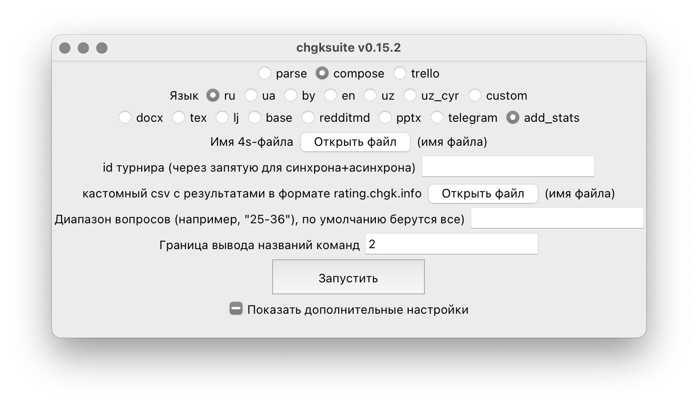

# Статистика взятий

Чтобы добавить статистику взятий, укажите id турнира через запятую без пробела и нажмите «Запустить». Статистика добавится в комментарии.

Иногда вы хотите выложить, скажем, только один тур из трёх. Тогда вам нужно указать диапазон вопросов, например `25-36`. Это значит, что к вопросу 1 в пакете подклеится статистика из вопроса 25 с турнирного сайта, к вопросу 2 — из вопроса 26, и так далее.

Если вашего турнира нет на турнирном сайте, вы можете подготовить кастомный csv в нужном формате и указать файл с ним в соответствующей графе.