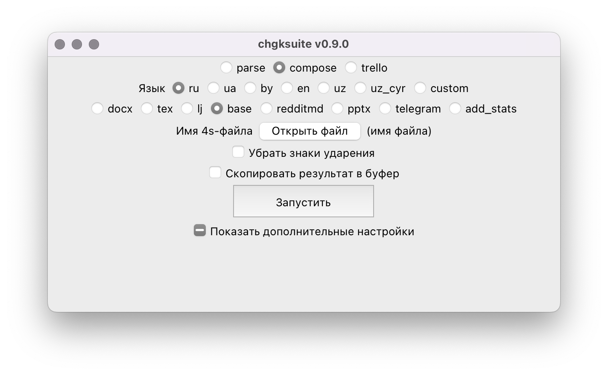
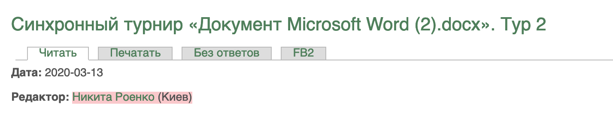
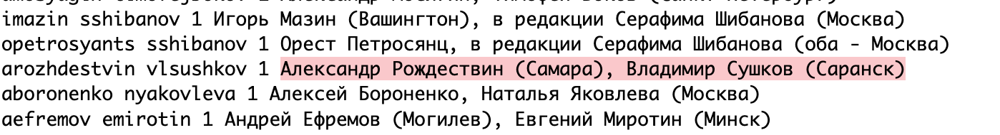

# Экспорт в Базу



Откройте **4s-файл**, который у вас получился после [парсинга](/4s). После запуска появится файл .txt, который можно будет открыть в любом текстовом редакторе. На что стоит обратить внимание:

- Во многих случаях **chgksuite** не может корректно отобразить дату. Поправьте её. Формат даты: `01-Feb-2020` или `01-Feb-2020 - 03-Feb-2020` для диапазона.
- Если в поле «Редактор» у вас было написано что-то типа «Редакторы пакета — Иванов, Петров, Сидоров»: префикс «Редакторы пакета» в базе нужно убрать. chgksuite пытается делать это самостоятельно, но не всегда получается.
- Все метакомментарии (`#`) склеиваются в один и помещаются перед пакетом.
- База не поддерживает нулевые вопросы в турах, поэтому chgksuite пытается вытащить их и оформить как отдельные туры по одному вопросу, которые называются «Нулевой вопрос». Опять же, если возникнут проблемы, поправьте текстовый файл самостоятельно.
- Возможно, будет полезна галочка «Убрать знаки ударения» — в этом случае они будут заменены заглАвными бУквами. Так поиск по Базе будет работать лучше.

Проверьте то, что у вас получилось, [валидатором](http://api.baza-voprosov.ru/validator) и выложите в Базу по [инструкции](https://db.chgk.info/add-questions).

## Подробнее об оформлении редакторов

Если вы уже выкладывали пакеты в Базу, то могли заметить, что ссылки на редакторов становятся активными не сразу после выкладки пакета. Сначала эти ссылки регулярно, раз в один-два дня, проставляет автоматический процесс. Он досимвольно сравнивает строчку в поле «Редактор» со строчками, уже присутствующими в Базе в поле «Редактор».

Если редактор(ы) вашего тура уже есть в Базе, скопируйте в поле «Редактор» любую соответствующую ему/им строчку — так ссылка появится быстрее. Например:



Если редактор вашего пакета работает уже давно, то может быть удобнее найти его в [этом файле](http://www.bilbo.dynip.com/cgi-bin/viewcvs.cgi/db/dict/authors?rev=HEAD;content-type=text%2Fplain). Например, комбинации редакторов «Владимир Сушков и Александр Рождествин» соответствует такая строчка в файле:



Скопируйте выделенный текст и вставьте в поле «Редактор:»

```
Редактор:
Александр Рождествин (Самара), Владимир Сушков (Саранск)
```

или

```
Редактор:
Никита Роенко (Киев)
```

Будьте внимательны, досимвольное совпадение — важно.

Если же автоматический процесс не нашёл совпадений или вашего редактора или набора редакторов в Базе ещё нет — раз в пару недель разработчик Базы Роман Семизаров вручную отсматривает новые поступления и добавляет в файл отсутствующих редакторов и их комбинации.