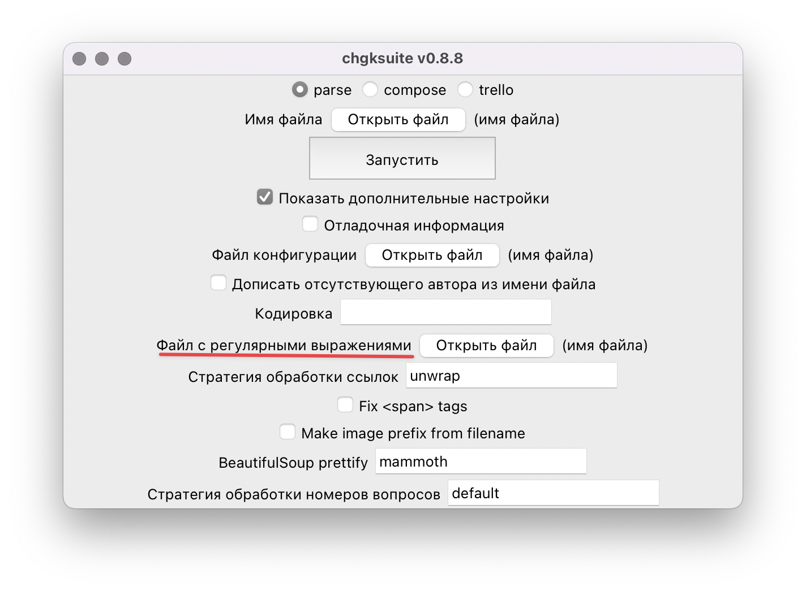
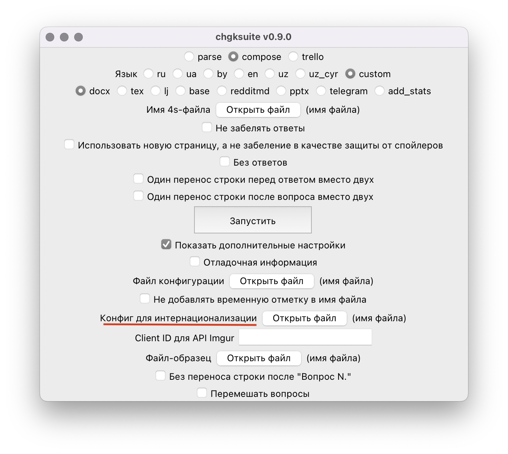

---
hide:
  - navigation
---

# Перевод и кастомизация

В chgksuite есть поддержка мультиязычности. В версии 0.9.0 поддержаны украинский, английский, беларусский и узбекский (латиница и кириллица) языки. Выбрать язык при парсинге и экспорте можно, ткнув в соответствующую радио-кнопку:


Мультиязычность сейчас работает при экспорте в ворд, пауэрпойнт, ЖЖ и телеграм. Реддит пока не поддержан, а при экспорте в Базу мультиязычность не имеет смысла, так как формат базы поддерживает только русскоязычные поля.

## Добавление нового языка

Для того, чтобы поддержать новый язык, нужно создать файлы `regexes_XX.json` и `labels_XX.toml` по образцу уже существующих. Путь к папке, где лежат существующие файлы, можно узнать, выполнив команду:

```
python -c "import chgksuite.common; print(chgksuite.common.get_source_dirs()[1])"
```

После этого созданный файл для парсинга можно подключить таким образом:



А файл для экспорта — так:



Обратите внимание, что в обоих случаях нужно выбрать `custom` в поле «Язык».

## Кастомизация полей

Если в одном конкретном вопросе одно конкретое поле хочется переименовать (например, в одном из вопросов «Вопрос» в «Загадка» или «Автор» в «Авторка»), можно написать в 4s что-то типа `? !!Загадка Один журналист отмечает...` или `@ !!Авторка Мария Подрядчикова`, и эти названия сохранятся в выходном файле.