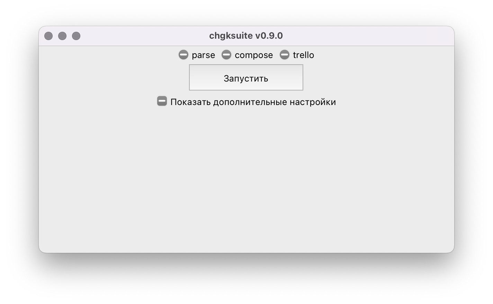

# Интро и установка

**chgksuite** — это система для работы с пакетами основной дисциплины ([КВРМ](https://www.maii.li/p/rules), «60 секунд», ЧГК). Она позволяет единообразно оформить вопросы, а также экспортировать их в разные форматы, в том числе с использованием спойлеров для ответов и комментариев.

## Установка

Начиная с версии 0.8.3, chgksuite доступна только через pip — пакетный менеджер языка Python.

Если у вас нет Python, проще всего установить его с использованием [miniconda](https://docs.conda.io/en/latest/miniconda.html). Скачайте версию для вашей системы и установите (на MacOS проще использовать `pkg`, чем `bash`).

Далее, на MacOS и Linux начните новую сессию в терминале, а на Windows запустите Anaconda Prompt.

## Если нужен графический интерфейс

Введите команду `pip install chgksuite-qt`. Будет установлена последняя версия.

Обновиться до последней версии также можно через pip: `pip install --upgrade chgksuite-qt chgksuite`.

## Если не нужен графический интерфейс (например, вы на удалённом сервере)

Введите команду `pip install chgksuite`. Обновлять: `pip install --upgrade chgksuite`.

## Если новый Qt интерфейс вам не нравится и скучаете по старому

Введите команду `pip install chgksuite-tk`. Обновлять: `pip install --upgrade chgksuite-tk chgksuite`.

## Запуск

Введите в терминале команду `chgkq` — запустится главное окно программы.

Если вы установили старый интерфейс `chgksuite-tk`, то команда называется не `chgkq`, а `chgkt`.

Дальнейшие действия описаны в следующих главах.

Команда `chgksuite` запускает чисто консольный интерфейс.

## Поддержка

С общими вопросами, ответы на которые могут быть полезны другим, пишите в [телеграм-чат chgksuite](https://t.me/chgksuite).

Если проблема с конкретным файлом, пишите [в телеграм](https://t.me/pecheny) или [на почту](mailto:ap@pecheny.me).