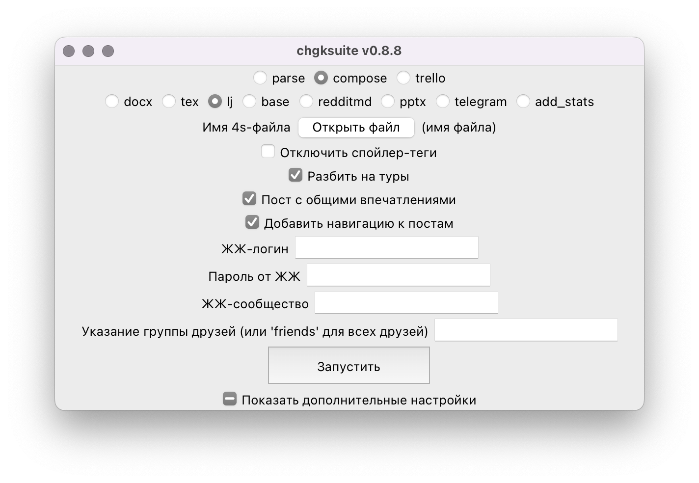

# ЖЖ

Откройте **4s-файл**, который у вас получился после [парсинга](/4s). Обратите внимание, что в формате 4s есть два поля «заголовок»: длинный заголовок `###` с формальным названием турнира — он будет включён в вордовский экспорт — и короткий для ЖЖ `###LJ`, так как длинный заголовок в постах ЖЖ неуместен.

Введите ваши логин и пароль в соответствующие поля формы. Если вы оставите поле «**ЖЖ-сообщество**» пустым, пакет будет выложен в ваш личный ЖЖ. При этом, если вы выкладываете в свой личный ЖЖ, то посты будут выложены «**под глаз**», то есть видимы только вам. Поэтому эта опция полезна в случае, если вы хотите тестово выложить файлы, чтобы посмотреть, не ошиблись ли вы с форматом и всё ли выглядит так, как вы того хотели. Убедившись, что всё так и есть, вы можете открыть посты для всех или, внеся нужные изменения, выложить пакет заново — уже в сообщество.

Стоит включить галочки «Разбить на туры», «Пост с общими впечатлениями» и «Добавить навигацию к постам», так же, как это сделано на скриншоте выше.