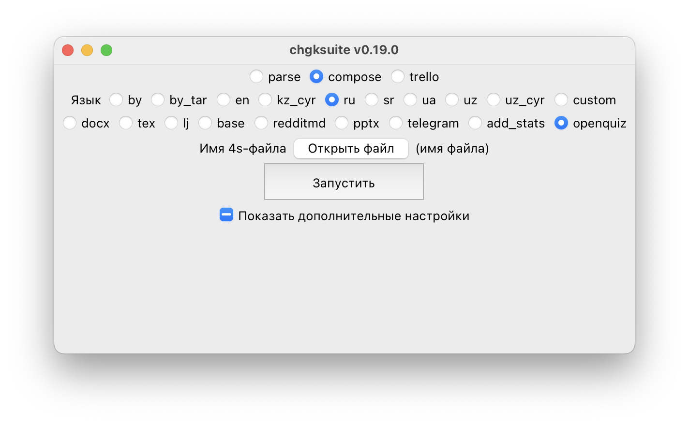
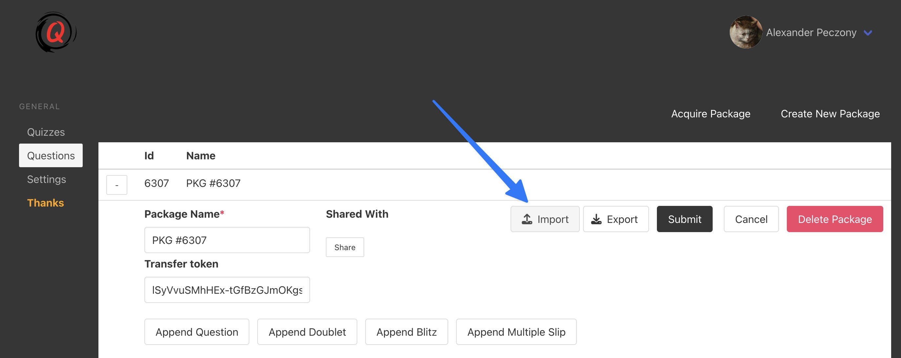

# Open-Quiz

Если вы проводите игры с использованием [Open-Quiz](https://www.open-quiz.com), эта функция может вам помочь. Она позволяет генерировать готовые json-файлы, которые можно затем импортировать в интерфейсе Open-Quiz. Выберите файл с пакетом и нажмите «Запустить» — в папке появится файл с расширением `.json`. Его вы можете загрузить в Опен-квизе вот так:

