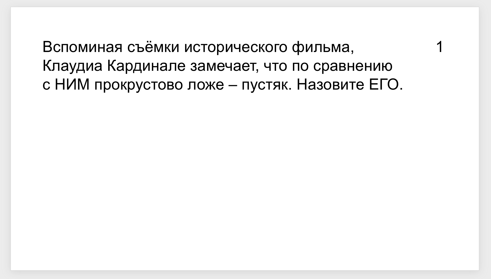
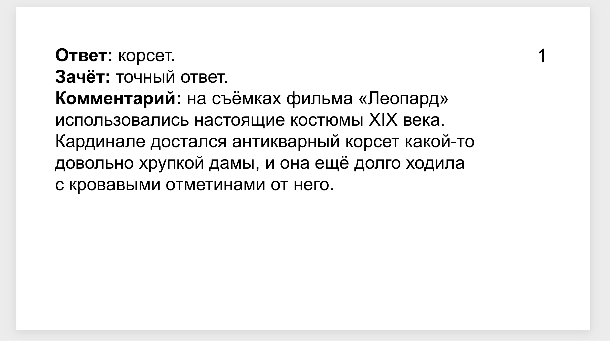
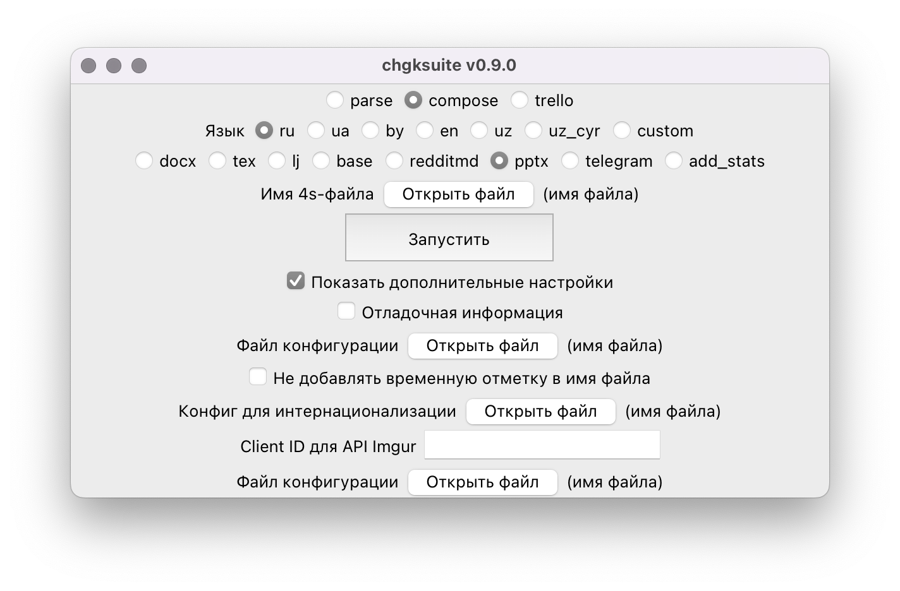

# PowerPoint


Для онлайн-игр может быть полезно создание презентаций. Откройте **4s-файл**, который у вас получился после [парсинга](../4s). После запуска появится презентация в pptx. В презентации автоматически удалены ударения и информация в квадратных скобках для ведущего, а также внесены изменения [из тега screen](../4s#screen).

После создания откройте файл — возможно, понадобится что-нибудь руками поправить.

По умолчанию слайды с вопросом и ответом выглядят так:




Если вы хотите использовать свой шаблон презентации, посмотрите в следующий пункт.

## Дополнительные настройки



Нажмите галочку «Показать дополнительные настройки» и пропишите путь к собственному файлу конфигурации.

Стандартный файл выглядит так:

```
template_path = "template.pptx"
add_plug = true
add_comment = true
add_zachet = true

[textbox]
left = 0.8
top = 0.8
width = 10.5
height = 6.1

[number_textbox]
left = 12
top = 0.8
width = 1
height = 1

[text_size_grid]
default = 32
smallest = 14
section = 36
elements = [
    {length=300, size=32},
    {length=400, size=30},
    {length=500, size=28},
    {length=600, size=26},
    {length=700, size=24},
    {length=800, size=22},
    {length=900, size=22},
    {length=1000, size=20},
    {length=1100, size=18},
    {length=1200, size=16},
]

[font]
name = "Arial"
```

В нём вас главным образом интересует поле `template_path` — это путь к презентации, которая используется в качестве шаблона. Если вы хотите использовать, например, свой фон — установите его в презентации и укажите путь к ней в `template_path`, затем сохраните файл конфигурации с расширением `.toml` и попробуйте запустить экспорт с ним. Возможно, вам захочется подвигать поле с текстом или номером вопроса — это можно делать с помощью полей `left` и `top` в `[textbox]` и `[number_textbox]`, соответственно.

Если вам нужна ещё какая-то помощь, [напишите мне](https://t.me/pecheny).

