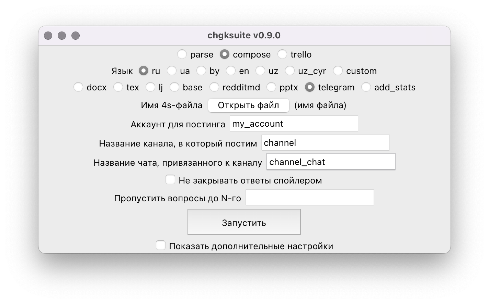

# Telegram

Сначала зайдите на <https://my.telegram.org/apps> и создайте новое приложение. Сохраните куда-нибудь ваши `api_id` и `api_hash`, вам потребуется ввести их позднее.

!!! info
    Это нужно делать с отключенным VPN, иначе может выдаваться ошибка. Если даже с отключенным VPN приложение не создаётся, попробуйте сделать это с телефона. Если и с телефона не получится, напишите мне.

Затем создайте телеграм-канал и привяжите к нему чат. Например, канал может называться `Обсуждение вопросов кубка Дружбы`, а чат — `Обсуждение вопросов кубка Дружбы Chat`.

Введите названия канала и чата в соответствующие поля формы. Обратите внимание: если ссылка на канал — `t.me/GoodCupQuestions`, а канал называется `Обсуждение Хорошего кубка`, то в форму надо вводить именно `Обсуждение Хорошего кубка`, а не `GoodCupQuestions`.

Поле «Аккаунт для постинга» не надо переименовывать, оно нужно, только если вы собираетесь использовать для выкладывания пакетов несколько разных аккаунтов телеграма.

Первый раз, когда вы будете выкладывать пакет, вам потребуется:

1. Ввести `api_id` и `api_hash`, которые вы сохранили вначале.
2. Залогиниться в ваш телеграм-аккаунт обычным способом: ввести привязанный номер телефона, одноразовый код и, если у вас включена 2FA, то пароль. 

!!! info
    Когда вводите пароль 2FA, звёздочки не показываются, и может создаться впечатление, что ничего не работает — но на самом деле это не так, всё работает. Просто введите пароль и нажмите Enter, всё должно получиться.

При последующих выкладываниях пакетов ничего заново вводить не потребуется. Если вы параноите, то можете удалять эту сессию сразу после выкладывания пакета — тогда потребуется снова логиниться каждый раз при выкладывании пакета (но `api_id` и `api_hash` вводить уже не потребуется).