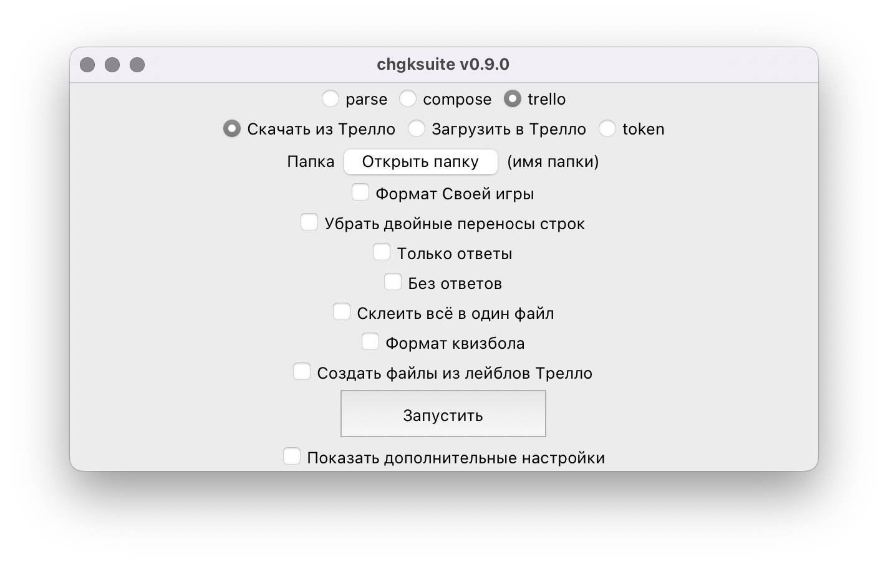
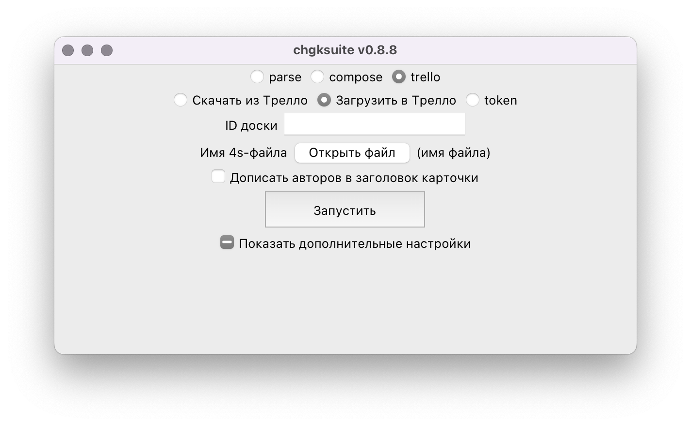

---
hide:
  - navigation
---

# Работа с Трелло

[Трелло](https://trello.com/) — не только удобный инструмент планирования и менеджмента задач, но и прекрасный инструмент работы с пакетами ЧГК. Об этом уже [писали и до меня](http://chgk-rostov.ru/articles/trello-for-chgk-intro). **chgksuite** позволяет как скачивать пакеты из Трелло, так и загружать их туда, но в этой статье описано лишь скачивание, потому что типичный процесс работы с пакетами в Трелло выглядит так: вы пишете вопросы прямо в Трелло, одна карточка — один вопрос. В **описании карточки** (а не в её названии, как в статье выше) находится текст вопроса, в комментариях — его обсуждение с соредакторами, предыдущие версии и так далее. Карточки в нужном порядке располагаются в списках. При скачивании из Трелло один список превращается в один документ 4s. Предполагается, что вы пишете вопросы уже в формате 4s, но на самом деле вы можете использовать любой формат, а уже после выгрузки из Трелло пересохранить файл, например, как docx и [распарсить](/4s) той же chgksuite.

## Получение токена

Перед тем, как работать с Трелло, нужно получить токен.

После нажатия на кнопку «Запустить» в браузере откроется страничка. Вы уже должны быть залогинены в Трелло в этом браузере. Нажмите на кнопку «Разрешить доступ». На экране появится токен. Скопируйте его и вставьте в консольное окно chgksuite. Токен сохранится — в папке `.chgksuite` внутри вашей пользовательской папки появится файл `.trello_token`.

Токен действует месяц. Потом его можно обновить, ещё раз запустив команду получения токена.

## Загрузка пакета из Трелло

chgksuite живёт в парадигме, что одна доска в Трелло соответствует одной папке. Поэтому создайте папку, которая будет соответствовать вашей доске. В неё всякий раз будет выгружаться свежая версия пакета из Трелло. Откройте папку и нажмите «Запустить». Если вы ещё ни разу не скачивали с этой доски, Трелло попросит вас вставить в консоль ссылку на доску. Сделайте это, и тогда chgksuite скачает все списки с вашей доски — по одному файлу 4s на список. Готово, теперь вы можете работать с ними, как с обычными 4s-файлами — делать из них docx, выкладывать в Базу и ЖЖ.

Как вы видите, тут много настроек, названия галочек, в принципе, говорят сами за себя, но когда-нибудь я их обязательно задокументирую :)

## Экспорт пакета в Трелло

Эта опция не очень часто нужна, но иногда нужна: например, вы компилируете пакет из вопросов разных авторов, тогда вам надо распарсить присланный вордовский файл и после этого открыть его, выбрав опции как на этом скриншоте и указав ID доски. Вопросы будут загружены в первый список (вы можете подвигать списки, чтобы нужный вам был первым).